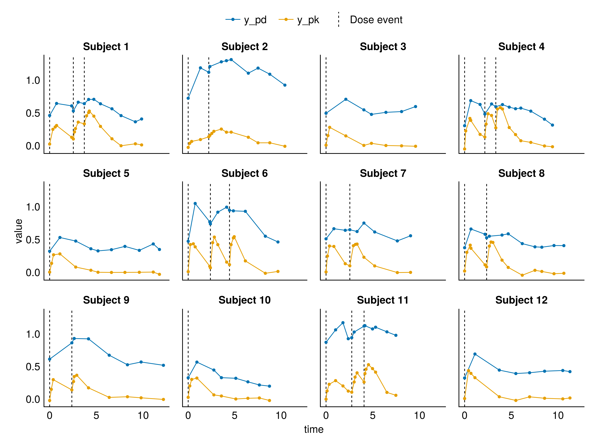

## Abstract

This benchmark provides a synthetic pharmacokinetic-pharmacodynamic (PK-PD) dataset generated from an indirect response (IDR) model with covariates that have a strong nonlinear effect on PKPD. The primary benchmarking task is predictive modeling: using the training data to build a model that achieves the best possible predictions on held-out test subjects. The dataset includes irregular sampling, multiple endpoints (PK concentration and PD response), inter-individual variability, and covariates with intentionally nonlinear effects that can improve predictions if properly leveraged.

## Background

Baseline covariates that influence patient outcomes and treatment effects presents an opportunity for improving pharmacometric models to better undestand diversity of outcomes and the role that an intervention had in shaping those outcomes.
Incorporation of such covariates into pharmacometric models is an established practice, often implemented through linear relationships between covariates and individual model parameters.
However, covariate effects are not always linear, and strongly nonlinear effects may be difficult to leverage effectively. 

This benchmark provides a simple scenario where six numerical baseline covariates are nonlinearly related to longitudinal outcomes. The dataset was designed to provide a small and targeted test case for leveraging nonlinearly predictive covariates. Six covariates affect pharmacologically relevant parameters that underlies a data-generating process. The covariate effects are distinct in that they each only affect a single pharmacological parameter. Together, the covariates account for roughly half the variability between different patients drug-conditioned timecourses, with the other half not being predictable at baseline.

Drug concentration and a drug response after one to three drug administration events are measured over time, as fairly dense but irregular sampling times. The concentration and response measurements are taken at the same times---mimicking visits to a clinic. However, the concentration has additional measurement immediately after dosing, which introduces heterogeniety in drug/response measurement times.


## Data Generation

### True Model Structure

The data were generated using an indirect response model with Emax-type drug stimulation of response production:

**Pharmacokinetic Model (2 compartments):**

$$
\frac{dA_{depot}}{dt} = -K_a \cdot A_{depot}
$$

$$
\frac{dA_{central}}{dt} = K_a \cdot A_{depot} - \frac{CL}{V_c} \cdot A_{central}
$$

**Pharmacodynamic Model (indirect response):**

$$
\frac{dR}{dt} = K_{in} \cdot (1 + EFF) - K_{out} \cdot R
$$

**Drug Effect (Emax model):**

$$
EFF = \frac{S_{max} \cdot C_p^n}{SC_{50}^n + C_p^n}
$$

where $C_p = A_{central} / V_c$ is the plasma concentration.

### Parameter Values

Population typical values:

| Parameter | Symbol | Value | Description |
|-----------|--------|-------|-------------|
| Absorption rate | $K_a$ | 1.904 h⁻¹ | First-order absorption |
| Clearance | $CL$ | 1.5 L/h | Drug elimination |
| Central volume | $V_c$ | 1.4 L | Distribution volume |
| Max stimulation | $S_{max}$ | 0.9 | Maximum drug effect |
| Hill coefficient | $n$ | 1.103 | Steepness of effect |
| SC₅₀ | $SC_{50}$ | 0.1 mg/L | Concentration at 50% effect |
| Response elimination | $K_{out}$ | 5.564 h⁻¹ | Response turnover |
| Response production | $K_{in}$ | 2.2 h⁻¹ | Baseline production |
| PK error SD | $\sigma_{PK}$ | 0.02 mg/L | Additive PK error |
| PD error SD | $\sigma_{PD}$ | 0.05 | Additive PD error |

### Covariate Effects

Six abstract covariates ($c_1$ through $c_6$) affect model parameters through **intentionally nonlinear and interacting relationships**:

**Absorption rate ($K_a$) — Interaction effect:**
$$
K_a = tvK_a \cdot \exp\left(\eta_1 + 1.5 \cdot \left(\text{logistic}(2 \cdot c_3 \cdot c_4) - 0.5\right)\right)
$$

**Response elimination ($K_{out}$) — Ratio/competition effect:**
$$
K_{out} = tvK_{out} \cdot \exp\left(\eta_2 + 1.6 \cdot \left(\frac{c_5}{c_5 + c_6} - 0.5\right)\right)
$$

**Maximum stimulation ($S_{max}$) — Saturation effect:**
$$
S_{max} = tvS_{max} \cdot \exp\left(\eta_3 \cdot 8 \cdot \left(\frac{c_1}{10 + c_1} - 0.476\right)\right)
$$

**Hill coefficient ($n$) — Power effect:**
$$
n = tvn \cdot \exp\left(\eta_4 + 0.1 \cdot \left(\left(\frac{c_2}{20}\right)^{0.75} - 1\right)\right)
$$


### Variability

**Residual error (observation model):**

$$
y_{PK} = C_p + \epsilon_{PK}, \quad \epsilon_{PK} \sim N(0, \sigma_{PK}^2)
$$

$$
y_{PD} = R + \epsilon_{PD}, \quad \epsilon_{PD} \sim N(0, \sigma_{PD}^2)
$$

where $\sigma_{PK} = 0.02$ mg/L (additive on concentration scale) and $\sigma_{PD} = 0.05$ (additive on response scale).

**Inter-individual variability (IIV):**

$$
\Omega = \text{diag}(0.2, 0.1, 0.1, 0.2)
$$

Applied to $K_a$, $K_{out}$, $S_{max}$, and $n$ respectively.

**Covariate Distributions:**

| Covariate | Distribution | Affects | Relationship |
|-----------|--------------|---------|--------------|
| $c_1$ | Gamma(5, 2) | $S_{max}$ | Saturation: $c_1/(10+c_1)$ |
| $c_2$ | Gamma(7, 3) | $n$ | Power: $(c_2/20)^{0.75}$ |
| $c_3$ | Normal(0, 1) | $K_a$ | Interaction with $c_4$ |
| $c_4$ | Normal(0, 1) | $K_a$ | Interaction with $c_3$ |
| $c_5$ | Gamma(11, 1) | $K_{out}$ | Ratio with $c_6$ |
| $c_6$ | Gamma(11, 1) | $K_{out}$ | Ratio with $c_5$ |

### Study Design

- **Dosing:** 1-3 oral doses of 1 mg at random times (Gamma-distributed intervals)
- **PK sampling:** Dense early sampling after each dose (2 observations within 0.5h)
- **PD sampling:** Sparse irregular sampling (6-10 observations over 10h)
- **Note:** PD observations are not collected during the early PK-focused windows

## Dataset Description

### Variables


| Column | Description |
|--------|-------------|
| `id` | Subject identifier |
| `time` | Time since first event (hours) |
| `evid` | Event ID (0=observation, 1=dose) |
| `y_pk` | PK observation (concentration, mg/L) |
| `y_pd` | PD observation (response units) |
| `amt` | Dose amount (mg) |
| `cmt` | Compartment (1=Depot for dosing) |
| `c1`–`c6` | Covariates |
| `split` | Dataset split ("train" or "test") |

### Sample Size

- **Training set:** 300 subjects, ~4,800 observations
- **Test set:** 1,000 subjects, ~16,000 observations

### Dataset Overview

```{=html}

```

### Sample Trajectories



## Task: Predictive Performance

**Objective:** Train a model on the training dataset that achieves the best predictive performance on the held-out test subjects.

**Evaluation Metric:** Marginal log-likelihood of the model evaluated on the test dataset.

The marginal log-likelihood integrates over the random effects, providing a principled measure of how well the model predicts new subjects without conditioning on their individual data:

$$
\mathcal{L}(\theta) = \sum_{i \in \text{test}} \log \int p(y_i | \eta_i, \theta) \, p(\eta_i | \theta) \, d\eta_i
$$


**Table: Marginal log-likelihoods of the data-generating model**

```{=html}

```

**Notes:**

- Models should be fit using only the training data (300 subjects)
- Evaluation is performed on the test data (1,000 subjects) using the fitted model parameters
- Both PK and PD observations contribute to the likelihood
- Covariates are available and may improve predictions if leveraged appropriately
- The covariate effects are intentionally nonlinear and interacting, making simple covariate models suboptimal

## Train/Test Split

The dataset uses a 300/1000 train/test split:

- **Training set:** 300 subjects for model fitting
- **Test set:** 1,000 subjects for evaluation

**Rationale:** The smaller training set creates a realistic scenario where data is limited. The large test set enables precise estimation of generalization performance and reduces evaluation variance.

## Reproducibility

The data generation is fully reproducible using the provided Julia script:

```bash
cd scripts
julia --project=.. generate_data.jl
```

**Requirements:** Pumas v2.8+


