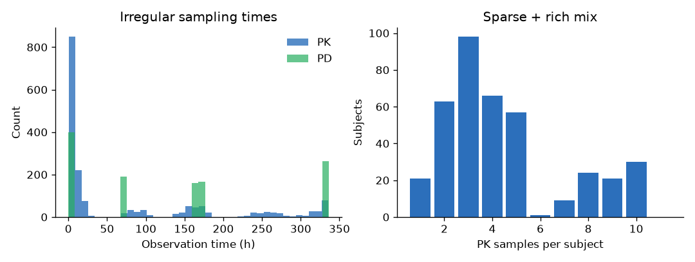
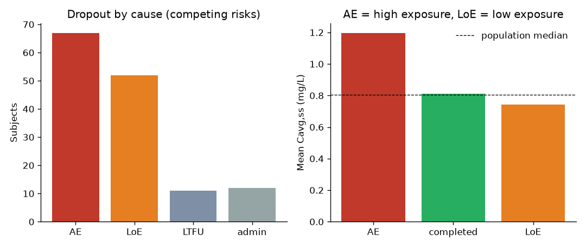
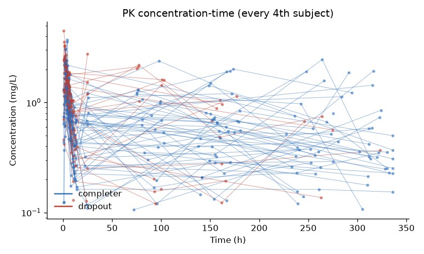
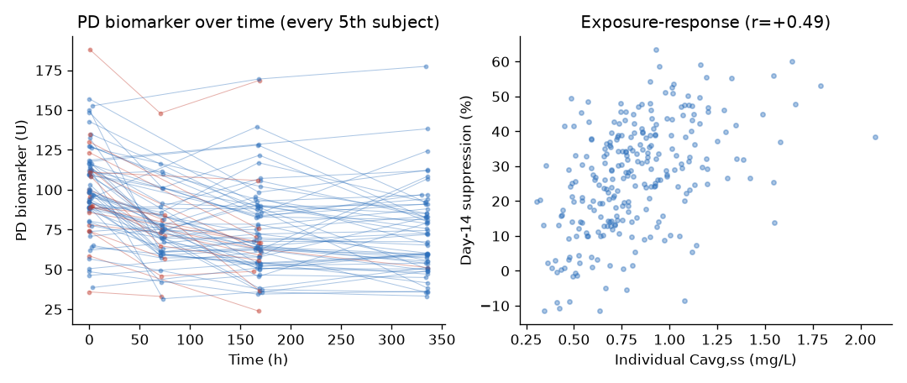
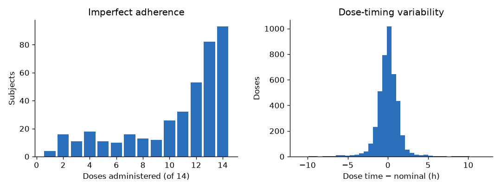
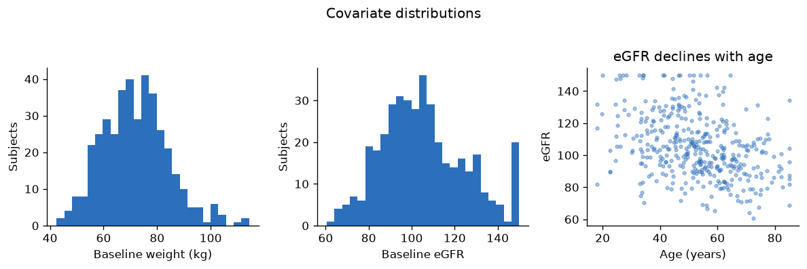

## Abstract

This benchmark provides a synthetic two-compartment oral population PK/PD dataset
designed to reproduce the characteristic difficulties of real clinical-development
data while keeping the data-generating process known exactly. On top of a standard
population-PK core (allometric weight and renal-function covariates, correlated
inter-individual variability, combined residual error, BLQ data, irregular
sampling) it adds the features that make real analyses hard: **imperfect adherence**
with dose-timing variability, **time-varying, noisy, and partly missing covariates**,
**interoccasion variability (IOV)**, an indirect-response **pharmacodynamic (PD)
biomarker** giving a true exposure–response relationship, **assay outliers**, and
**competing-risk multi-cause informative dropout** (adverse-event dropout driven by
high exposure; lack-of-efficacy dropout driven by poor response; plus
non-informative loss-to-follow-up and administrative withdrawal). Five tasks span
the core model-informed drug-development decisions: PK prediction, PD/exposure–
response prediction, dropout-risk prediction, and two counterfactual dose-selection
questions.

**Keywords:** population PK/PD, exposure–response, covariate modeling, adherence,
interoccasion variability, informative dropout (MNAR), dose individualization, synthetic data

## Motivation

**The field-level problem.** Essentially every late-phase population PK/PD
analysis confronts the same compounding degradations: patients miss and mistime
doses, so the recorded dosing history is wrong; covariates drift over time, are
measured with error, and go unrecorded; parameters vary within a patient across
occasions; observations are censored at the assay limit and contaminated by gross
errors; and a third of subjects leave the study for reasons correlated with the
very exposure and response being modeled — adverse-event dropout concentrating at
high exposure while lack-of-efficacy dropout concentrates at poor response, so the
missingness is not-at-random in **two opposing directions at once**. Each of these
violates an assumption of the standard NLME workflow, and their joint effect on
estimation, individual prediction, and model-based dose selection is essentially
uncharacterized — because with real data the truth is never known, and because the
methods proposed to cope (joint longitudinal–dropout models, MNAR corrections,
adherence-aware estimation, ML and hybrid mechanistic–ML approaches) are each
validated on bespoke, unpublished simulations that make results incomparable
across papers. The field lacks what protein structure prediction gained from
CASP: a common, hard, realistic problem on which competing methods are scored
identically.

**What this benchmark contributes.** A single standardized testbed in which all
of these degradations co-occur at realistic magnitude while the generative truth
remains exactly known and **byte-reproducible** from the included seeded
generator. Five typed tasks map directly onto drug-development decisions:
individual PK forecasting under corrupted dosing histories (therapeutic drug
monitoring), exposure–response characterization, discontinuation-risk prediction
that rewards exploiting both MNAR channels, and two counterfactual dose-selection
questions scored against re-simulated truth. The counterfactual tasks are a
deliberate discriminator: they require extrapolation beyond the observed dose,
which pattern-matching methods cannot do by construction — separating methods
that have learned the pharmacology from methods that have memorized the data.
A built-in confounded decoy covariate (age, marginally associated with clearance
but null given renal function) likewise separates causal covariate selection from
naive association screening.

**Most similar existing datasets, and the concrete difference.** Within this
repository, `example-pk-model-selection` targets structural model selection on
clean, regularly sampled data; this submission is its designed complement — the
model is fixed and the challenge is inference under realistic degradation. Public
teaching datasets (theophylline, warfarin) are small, clean, and truthless;
model/data repositories (e.g. nlmixr2 example data, DDMoRe) host models and
datasets but not scored, task-defined benchmarks; simulation studies in the
methods literature embed individual features (dropout *or* adherence *or* BLQ)
but are neither released, standardized, nor jointly realistic. To our knowledge
no public pharmacometric benchmark combines imperfect adherence, IOV,
time-varying/noisy/partly missing covariates, BLQ, outliers, a true
exposure–response endpoint, and opposite-direction competing-risk MNAR dropout
with typed, metric-scored tasks and deposited counterfactual truth. A
label-masked variant can be released for blind community competitions and
rankings.

## Background

Population PK/PD is the analytical backbone of model-informed drug development, and
a benchmark that is runnable with any tool (NONMEM, Monolix, nlmixr2, Pumas, or
ML/SciML methods) yet faithful to real data is broadly valuable: it lets methods
papers report results on a common, ground-truth dataset and be compared directly.

Real analyses are hard for reasons that idealized simulations usually omit. This
benchmark deliberately encodes the most important of them:

- **Adherence is imperfect** — patients miss doses and take them off-schedule, so
  exposure is irregular and dosing histories are incomplete.
- **Covariates move and are missing** — weight and renal function change over time,
  are measured with error, and are sometimes not recorded.
- **Within-subject variability (IOV)** means a parameter is not even constant within
  a patient across occasions.
- **Dropout is informative and multi-causal** — high-exposure patients leave for
  tolerability while poor responders leave for lack of efficacy, biasing naïve
  analyses in opposite directions (missing not at random).
- **Data are dirty** — assay outliers and BLQ records are routine.

Because the truth is known, methods can be scored on how well they cope with all of
this. The dataset is intentionally complementary to the repository's
`example-pk-model-selection` benchmark (which targets structural model selection):
here the model is fixed and the challenge is estimation, prediction, and
decision-making under realistic data degradation.

## Data Generation

### Study design

- **Population:** 400 virtual subjects; 100 mg oral dose intended once daily for 14 days.
- **Adherence:** per-subject adherence drawn from Beta(9, 1) (population mean ≈ 0.90);
  each scheduled dose is taken with that probability, and the actual administration
  time deviates from nominal by N(0, 1 h) (10% of doses N(0, 4 h)). The released
  dosing rows reflect the **actually administered** doses (≈10.6 of 14 on average).
- **PK sampling:** irregular; ~25% rich (Phase-1-like) profiles, ~75% sparse
  (two early samples + visit-based troughs/peaks), ±8% time jitter.
- **PD sampling:** baseline + day-7 and day-14 (± day-3), reflecting clinic visits.
- **BLQ:** PK LLOQ = 0.10 mg/L (≈13% of PK samples, mostly troughs under non-adherence).
- **Data quality:** ≈2% of observations are gross assay outliers.



### Structural PK model

Two-compartment, first-order oral absorption, linear elimination
($CL=5$ L/h, $V_c=30$ L, $Q=4$ L/h, $V_p=50$ L, $k_a=1.0$ h⁻¹, $F=1$;
terminal half-life ≈ 18 h):

$$
\frac{dA_{gut}}{dt} = -k_a A_{gut},\quad
\frac{dA_{c}}{dt} = k_a A_{gut} - \Big(\tfrac{CL}{V_c}+\tfrac{Q}{V_c}\Big)A_{c} + \tfrac{Q}{V_p}A_{p},\quad
\frac{dA_{p}}{dt} = \tfrac{Q}{V_c}A_{c} - \tfrac{Q}{V_p}A_{p}
$$

with $C = A_c/V_c$.

### PD model (exposure–response)

An indirect-response (turnover) model in which drug **inhibits production** of a
biomarker $R$ (baseline $R_0=100$ U, $k_{out}=0.05$ h⁻¹, $I_{max}=0.8$, $IC_{50}=1.0$ mg/L):

$$
\frac{dR}{dt} = k_{in}\Big(1 - \frac{I_{max}\,C}{IC_{50}+C}\Big) - k_{out} R,
\qquad k_{in} = k_{out} R_0
$$

Higher exposure produces greater steady-state suppression — a true, identifiable
exposure–response relationship (observed correlation between $C_{avg,ss}$ and day-14
suppression ≈ +0.49).

### Covariate model (true relationships)

$$
CL_i = 5\left(\tfrac{WT_i}{70}\right)^{0.75}\left(\tfrac{eGFR_i}{100}\right)^{0.70} e^{\eta_{CL,i}+\kappa_{CL,i,occ}},\quad
V_{c,i}=30\left(\tfrac{WT_i}{70}\right)e^{\eta_{V_c,i}},\ \dots
$$

Weight and eGFR are near-orthogonal, so both exponents are identifiable. **Age and
sex have no direct PK effect**, but eGFR declines with age, so age is a *confounded
decoy*: associated with clearance marginally, null conditional on eGFR. Covariates
$WT$ and $eGFR$ are **time-varying** (between-occasion drift), recorded with
**measurement error** (≈1% / 8% CV) and **partly missing** (≈5% of subjects lack
eGFR; ≈3% of rows missing sporadically).

### Variability

Log-normal IIV (SD): $CL$ 0.30, $V_c$ 0.25, $Q$ 0.35, $V_p$ 0.30, $k_a$ 0.50, with
$\rho(\eta_{CL},\eta_{V_c})=0.40$; PD $R_0$ 0.25, $IC_{50}$ 0.40. **Interoccasion
variability** $\kappa$ on $CL$ (SD 0.17) and $k_a$ (SD 0.30) across two occasions
(days 0–7, 7–14). PK residual error is combined (20% proportional + 0.02 mg/L
additive); PD residual error is 15% proportional.

### Multi-cause informative dropout

A discrete-time competing-risks model over 14 days with four causes:

$$
h^{AE}_i = 0.009\,e^{0.9\,z(\log \bar C_{ss,i})+0.4\,z(\text{age}_i)},\quad
h^{LoE}_i = 0.006\,e^{1.1\,z(\text{poor response}_i)},\quad
h^{LTFU}=0.003,\quad h^{admin}=0.0015
$$

Adverse-event dropout rises with **exposure**; lack-of-efficacy dropout rises with
**poor PD response**; LTFU and administrative withdrawal are non-informative. The
two informative causes pull in opposite directions, so the missingness is MNAR and
cannot be handled by exposure alone. Overall dropout ≈ 35% (AE 67, LoE 52,
LTFU 11, admin 12 subjects).



### Reproducibility

The distributed CSVs and both counterfactual truth files were produced by a single
seeded script, `src/generate_data.py` (seed = 20260614). A community-standard
`src/generate_data.R` (mrgsolve + tidyverse) implements the same model. RNG streams
differ across languages, so the R script reproduces a statistically equivalent
dataset; the Python output is the canonical artifact. `src/qa_check.py` reproduces
all verification checks.

## Dataset Description

### Variables

Standard NONMEM-style layout (`data/data-dictionary.yml`, yspec-style):
`ID, TIME, TAD, DVID, AMT, DV, EVID, MDV, CMT, BLQ, DOSE, WT, EGFR, AGE, SEX,
DROPOUT, DROPOUT_REASON`. Observation type is given by **DVID** (1 = PK plasma
concentration in mg/L, 2 = PD biomarker in U); `CMT` is 1 = depot, 2 = central,
3 = response. `DV = "."` marks dosing rows and BLQ records.

### Sample size

| Set | Subjects | PK obs | PD obs | Total obs |
|-----|----------|--------|--------|-----------|
| Train | 280 | 1372 | 833 | 2205 |
| Test | 120 | 622 | 349 | 971 |
| **Total** | **400** | **1994** | **1182** | **3176** |









## Tasks

Evaluation is on the **test set**; submissions provide the output declared in
`metadata.yml`.

### Task 1 — PK concentration prediction (regression)

Predict plasma concentration at each quantifiable PK test observation
(`DVID=1`, `BLQ=0`). **Output:** `[ID, TIME, DVID, PRED]`. **Metric:** RMSE (mg/L),
computed over all test rows with `DVID=1` and `BLQ=0` (BLQ records are excluded from
scoring; gross assay outliers, ≈2% of observations, are **not** excluded — robustness
to them is part of the challenge).
*Decision context:* therapeutic drug monitoring / Bayesian forecasting under
imperfect dosing histories.

### Task 2 — PD biomarker / exposure–response prediction (regression)

Predict the PD biomarker at each PD test observation (`DVID=2`).
**Output:** `[ID, TIME, DVID, PRED]`. **Metric:** RMSE (U).
*Decision context:* characterizing exposure–response.

### Task 3 — Multi-cause dropout prediction (classification)

Predict the probability each test subject discontinues before completing the study.
**Output:** `[ID, P_DROPOUT]`. **Metric:** AUROC against the subject-level `DROPOUT`
label. *Decision context:* trial retention and exposure-safety risk; rewards methods
that exploit both the exposure (AE) and response (LoE) channels.

### Task 4 — Cmin,ss under 2× dose (counterfactual)

Predict the population distribution of steady-state trough ($C_{min,ss}$) under
200 mg QD. **Output:** quantiles `[q10, q25, q50, q75, q90]`.
**Ground truth:** `tasks/cmin_2x_truth.yml` (20,000-subject virtual population,
structural + IIV, no IOV/RUV, full adherence):

| q10 | q25 | q50 | q75 | q90 |
|-----|-----|-----|-----|-----|
| 0.249 | 0.370 | 0.565 | 0.839 | 1.169 |

**Metric:** quantile coverage. *Decision context:* dose selection / target attainment.

### Task 5 — PD suppression under 2× dose (counterfactual)

Predict the population distribution of steady-state biomarker suppression (% from
baseline) under 200 mg QD. **Output:** quantiles. **Ground truth:**
`tasks/pd_response_2x_truth.yml`:

| q10 | q25 | q50 | q75 | q90 |
|-----|-----|-----|-----|-----|
| 25.96 | 32.44 | 40.50 | 48.35 | 54.72 |

**Metric:** quantile coverage. *Decision context:* model-based exposure–response dose selection.

## Train/Test Split

Subjects are split 70/30 (280/120) by **subject ID** (no record appears in both
sets), stratified on eGFR quartile × dropout status:

| Set | n | Weight (kg) | eGFR | Age | % male | Dropout % |
|-----|---|-------------|------|-----|--------|-----------|
| Train | 280 | 72.1 | 105.1 | 52.7 | 50 | 35.4 |
| Test | 120 | 71.3 | 105.8 | 53.2 | 50 | 35.8 |

## Verification

`src/qa_check.py` confirms: no subject-ID overlap; recovery of the true covariate
exponents (WT 0.74 vs. true 0.75; eGFR 0.78 vs. true 0.70, within sampling error);
the confounded-decoy behaviour of age; the exposure–response signal (corr ≈ +0.49);
competing-risk dropout in opposite exposure directions (AE mean $C_{avg}$ 1.20 vs.
LoE 0.74, AE rate 4.5%→34% across exposure tertiles); presence of IOV, time-varying
and missing covariates, outliers, and ≈13% BLQ; and ODE-solver accuracy (numerical
steady-state $\bar C_{ss}$ matches the analytic $\text{Dose}/(CL\cdot\tau)$ to <0.1%;
typical-subject $C_{min,ss}$ at 200 mg = 0.606 mg/L, consistent with the truth file).

### NLME parameter recovery (reference fit)

To demonstrate identifiability under the released design, the true structural
model (2-compartment oral, allometric WT + eGFR on CL) was fitted to the
**training set** with FOCEI in nlmixr2 (`src/fit_nlmixr2.R`; BLQ excluded (M1),
baseline covariates, IIV on CL/Vc/ka, IOV deliberately not modeled). The fit
converged with a successful covariance step (condition number 24):

| Parameter | True | Estimated (SE) | Rel. bias |
|---|---|---|---|
| CL (L/h) | 5.0 | 5.06 (0.12) | +1.2% |
| Vc (L) | 30 | 34.7 (2.0) | +15.6% |
| Q (L/h) | 4.0 | 3.61 (0.25) | −9.8% |
| Vp (L) | 50 | 45.6 (2.5) | −8.8% |
| ka (1/h) | 1.0 | 1.09 (0.09) | +8.9% |
| WT exponent on CL | 0.75 | 0.62 (0.13) | −16.9% |
| eGFR exponent on CL | 0.70 | 0.54 (0.11) | −22.4% |
| ω(CL) (SD) | 0.30 | 0.31 | +3.5% |
| ω(ka) (SD) | 0.50 | 0.51 | +1.3% |
| prop. error (SD) | 0.20 | 0.29 | +46% |
| add. error (mg/L) | 0.02 | 0.019 | −4.0% |

The deviations are themselves informative about the designed degradations:
typical clearance and its IIV are recovered almost exactly; the covariate
exponents land within 1–1.5 SE of truth with the attenuation expected from
regression dilution (recorded WT and eGFR carry 1%/8% measurement error);
and the inflated proportional error absorbs exactly what the fit deliberately
ignored — interoccasion variability, dose-timing error, and assay outliers.
Methods that model these features explicitly have quantifiable headroom over
this reference fit.

## Usage Example

```python
import pandas as pd
train = pd.read_csv("data/train.csv")
test = pd.read_csv("data/test.csv")
pk = train[(train.DVID == 1) & (train.DV != ".")].assign(DV=lambda d: d.DV.astype(float))
pd_ = train[train.DVID == 2].assign(DV=lambda d: d.DV.astype(float))
```

```r
library(readr)
train <- read_csv("data/train.csv")   # DVID: 1 = PK, 2 = PD; '.' = missing DV
```

## Known Limitations

- Synthetic data from a single known model; absolute performance numbers are not
  intended to transfer to any specific compound.
- A single dose level is studied; counterfactual tasks probe 2× extrapolation, which
  is informative but linear in PK by construction.
- PK is linear (no TMDD/saturable kinetics); a single trial/population is represented.
- Test labels (`DV`, `DROPOUT`) are released with the data per repository convention;
  a label-masked variant can be released for blind competitions.

## Changelog

- **v2.0.0** — added imperfect adherence + dose-timing error, time-varying/noisy/
  missing covariates, IOV, a PD exposure–response endpoint, competing-risk
  multi-cause dropout, and assay outliers; expanded to five tasks; new columns
  `TAD`, `DVID`, `DROPOUT_REASON`.
- **v1.0.0** — initial population-PK benchmark.

## References

1. Mould DR, Upton RN. Basic concepts in population modeling, simulation, and
   model-based drug development. *CPT Pharmacometrics Syst Pharmacol.* 2012;1:e6.
2. Anderson BJ, Holford NHG. Mechanism-based concepts of size and maturity in
   pharmacokinetics. *Annu Rev Pharmacol Toxicol.* 2008;48:303-332.
3. Dayneka NL, Garg V, Jusko WJ. Comparison of four basic models of indirect
   pharmacodynamic responses. *J Pharmacokinet Biopharm.* 1993;21(4):457-478.
4. Hu C, Sale ME. A joint model for nonlinear longitudinal data with informative
   dropout. *J Pharmacokinet Pharmacodyn.* 2003;30(1):83-103.
5. Beal SL. Ways to fit a PK model with some data below the quantification limit.
   *J Pharmacokinet Pharmacodyn.* 2001;28(5):481-504.

## License

Released under the **MIT License**, the repository's single licence for data and
code alike. Attribution is not a legal condition, but please cite the benchmark
(below) when using it.

## Citation

> Farnoud A, Saini A. (2026). *Population PK/PD with Covariates and Informative Dropout.*
> Pharmacometrics Benchmarks Initiative. DOI: TBD
